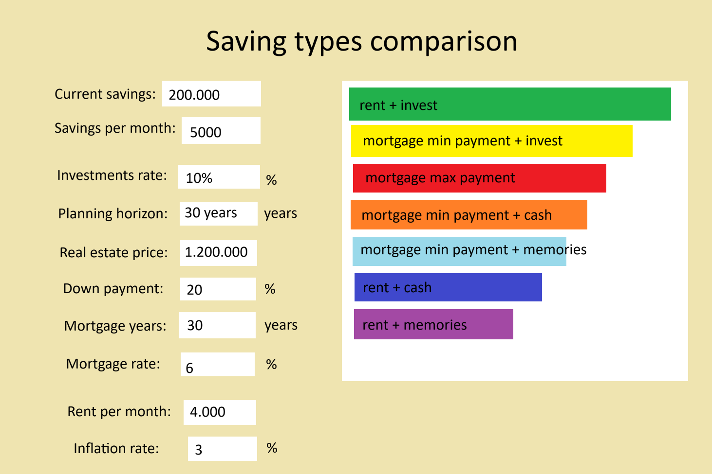

I want to create a web app.

It's a one-pager without backend - all the calculations and logic will be done on the frontend.

It should take a bunch of inputs (with default values) and calculate different saving strategies outcome for specified time period.

Below is a picture of the design I have in mind. The app should be responsive and work on mobile devices as well.
The UI should use some modern library, especially for the chart, so it feels smooth and looks nice.
As soon as user changes any of the inputs, the results should be recalculated and displayed immediately.
